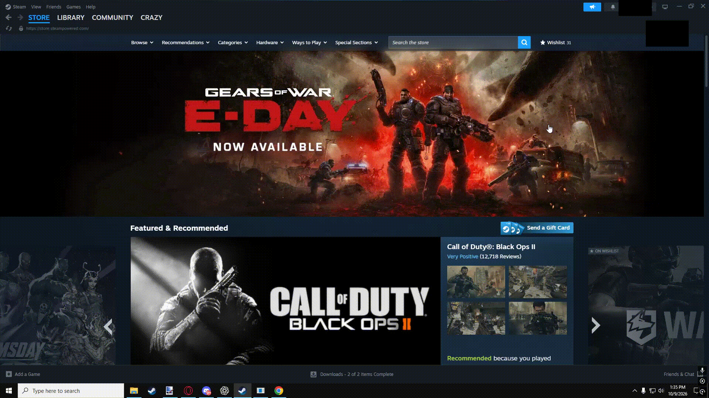

# Scroll-Tabber
A free Windows utility for switching between tabs using your mouse wheel.

Scroll Tabber simulates the functions of Alt + Tab with a few more options and much better efficiency.

Features

Mouse Wheel Tilt Navigation – Quickly cycle through open windows using your mouse wheel's tilt buttons.

Middle-Mouse Hub – Access a convenient window-switching interface with your middle mouse button.

Multi-Monitor Support – Switch between windows while working across multiple monitors without having to click for window focus. Scroll Tabber functions by where the mouse hovers, rather than having to click to manually change focus.

Customizable Options – This utility runs in the background so it easily stays out of your way.

Easy Installation – Install Scroll Tabber and start using it without complicated setup.
