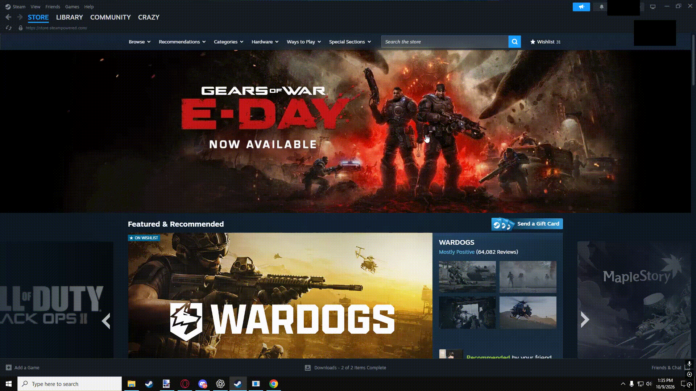
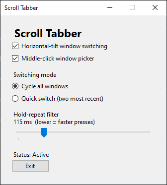

# Scroll Tabber

**A free Windows utility for switching between open windows using your mouse wheel.**

Scroll Tabber brings the functionality of **Alt + Tab** to your mouse, making switching between applications faster, easier, and more convenient.

---

## Features

### Mouse Wheel Tilt Navigation

Quickly cycle through open windows using your mouse wheel's left and right tilt buttons.

### Middle-Mouse Hub

Access a convenient window-switching interface by clicking your middle mouse button.

### Multi-Monitor Support

Seamlessly switch between windows across multiple monitors **without needing to click to change window focus**.

Scroll Tabber detects which monitor your mouse is hovering over, allowing you to navigate windows without manually activating them first.

### Customizable Options

Personalize Scroll Tabber to fit your workflow.

- **Adjustable Scroll Sensitivity:** Control how quickly the mouse wheel's tilt buttons cycle between windows.
- **Rapid Window Switching:** Lower sensitivity values allow faster switching between windows.
- **Continuous Switching:** Set the sensitivity extremely low to automatically cycle through windows while holding a tilt button.
- **Additional Settings:** Customize the application to suit your preferences.

### Easy Installation

Getting started takes just a few steps:

1. Download and run the Scroll Tabber installer.
2. Choose your preferred settings.
3. Adjust your mouse wheel tilt sensitivity.
4. Start switching between windows!

---

## Download

**Scroll Tabber is completely free to download and use.**

**[Download Scroll Tabber v1.0.3 for Windows](https://github.com/crazybombguy/Scroll-Tabber/releases/download/v1.0.3/ScrollTabber-Setup-1.0.3-win-x64.exe)**
